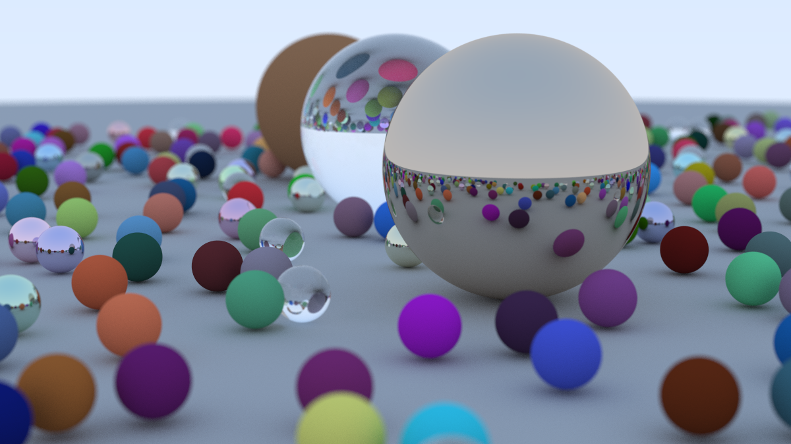

# Raytracer

This raytracer was made following [_Ray Tracing in One Weekend_](https://raytracing.github.io/books/RayTracingInOneWeekend.html)

One small note, if you choose to run this program, it will render for a few hours because it is taking 500 samples per pixel. Change this to 10 in [ main.cpp](https://github.com/gcmaidana/raytracer/blob/main/main.cpp) if you want a faster render.

Here is the final render that took me a few hours

 
